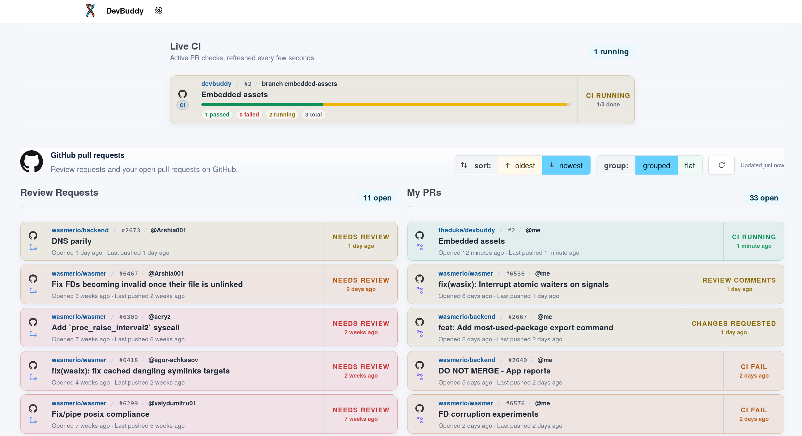

# DevBuddy

DevBuddy is a focus-first companion for developers who want to stay on top of the work that actually matters.
It brings your active tasks, reviews, and notifications into one calm dashboard so you can triage faster and miss less.

The goal is simple: fewer tabs, fewer surprises, faster decisions.

DevBuddy gives you one place to see what needs attention now and what might
need attention next.



## What it is

DevBuddy is built to help you keep up with the flow of day-to-day engineering work:

- what needs your review
- what you opened and still need to finish
- what is currently running in CI
- what just changed while you were away

It is designed as a lightweight command center for developer work,
with more sources and workflows planned beyond GitHub.

## Supported today

- GitHub pull request review requests
- your open GitHub pull requests
- PR sorting: oldest / newest
- PR grouping: grouped / flat
- live CI status for active PRs
- desktop notifications for relevant changes
- local persistence of config and cached items
- GitHub token detection from config, env vars, or `gh`

## Coming soon

- Linear issue tracking
- Linear inbox notifications
- broader work-item aggregation across tools
- more notification and triage workflows

## Why DevBuddy


## Running

```bash
cargo run
```

## Tech stack

- Rust
- Dioxus 0.7
- GitHub GraphQL API
- local file-backed storage
- desktop notifications

## License

See the repository history or project owner for licensing details.
